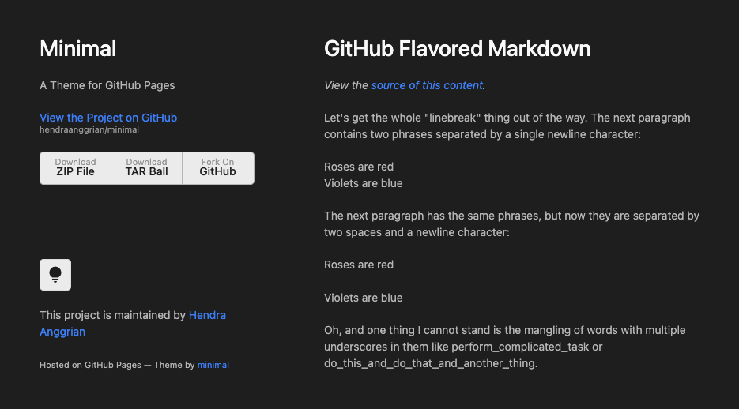

# Minimal Theme

A simple single page website theme with toggleable dark mode. Originally from [Minimal](https://github.com/orderedlist/minimal), this fork specializes in dark mode and generating webpages by command line or Gradle plugin.

Head to [repository website](https://hendraanggrian.com/minimal-theme/) for demo of the theme.

## Usage

The raw source code is located in root directory (`images`, `scripts`, `styles`, `index.html`), they can be used to replicate the page by manually editing `index.html`.

### [Command Line](cli.md)

Generates complete directory with data pulled from GitHub.

### [Gradle Plugin](https://github.com/hendraanggrian/pages-gradle-plugin/)

Allows maximum configuration in Gradle project.
